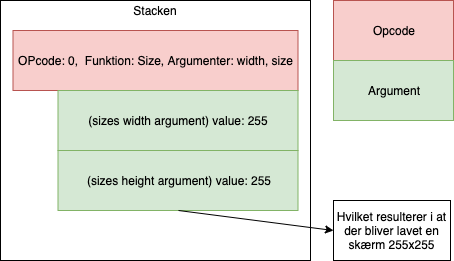

Brainfuck med p5.js
=======

## Ideén  
Bestanddele  
* Brainfuck interpreter
⋅⋅* Selve fortolkeren
⋅⋅* Stepthrough værktøjer m.m.
* Funktions stack evaluator
⋅⋅* Selve evaluerings mekanismen
⋅⋅* De individuelle opcodes

En brainfuck intrepreter lavet i p5 med gode visualiseringer og stepthrough muligheder af eksikveringen af brainfuck koden. Det ville gøre jeg kunne hoste det som en github.io side og det ville være nemmere at have et rent tekst input felt med koden. Derudover kunne man også give den nødvendige forklaring i noget ovenstående html osv.

Derudover skal der være et brainfuck interface til p5s tegne funktioner.  
Det skal ske gennem et stack, hvor man lægger en funktion på (i form af en opcode), der eksikveres når det rette antal argumenter er givet.  
Der vil være to forskellige operationer for at skubbe en opcode og et argument, da man også skal kunne bruge evaluerede opcodes til argument.

Jeg uvider derfor brainfucks operationssæt med to symboler nemlig : og ; hvor den første er pushOPCODE og den anden er pushARG.

Her er en tabel over mulige opcodes med beskrivelse, argumenter, effekt og returnværdi.  

Opcode	|Funktion	|Argumenter	|Beskrivelse
---|---|---|---
0|	size|	width, height|		sæt skærm til width, height (Default værdi 500x500)
1|	fillGrey|	greyscale|		sæt fill-farven med et argument mellem 0-255
2|	fill|	r,g,b|	sæt fill-farven med r,g,b værdier som argumenter
3|	backgroundGrey|	greyscale|	sæt baggrundsfarven med et argument mellem 0-255
4|	background|	r,g,b|	sæt baggrundsfarven med r,g,b værdier som argumenter
5|	rect|	x, y, w, h|	tegn et rektangel ved x, y som er w bredt og h højt
6|	circle|	x, y, r|	tegn en cirkel ved x, y med radius r
7|	line|	x1, y1, x2, y2|	tegn en linje mellem punktet x1, y1 og x2, y2

Her er et billede af hvordan jeg forestiller mig at stacken kommer til at fungere.  

Ligesom der i p5 og p5 er en draw funktion, man kan køre igen og igen tror jeg det også må være essentielt at få lavet et uendeligt loop i BF (altså den må ikke bare timeoute (man kunne sige hvis der var en opcode i et loop, så var der ingen bund) og da det er client-side skal vi ikke være bange for nogle kæmpe hosting regninger)

For at demonstrerer yderligere tænker jeg muligvis at lave en bf version af pong, hvis det kan lade sig gøre